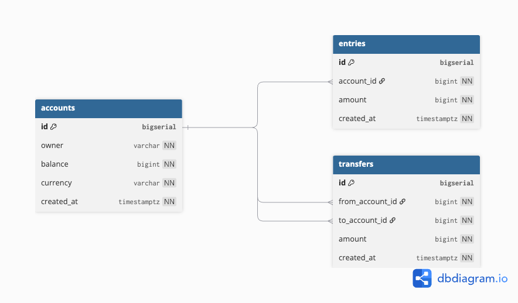

# simple-bank-go-project
simple bank go project


# Migration in Golang
```zsh
$ brew install golang-migrate
```

## Usage
```
$ migrate -help
Usage: migrate OPTIONS COMMAND [arg...]
       migrate [ -version | -help ]

Options:
  -source          Location of the migrations (driver://url)
  -path            Shorthand for -source=file://path
  -database        Run migrations against this database (driver://url)
  -prefetch N      Number of migrations to load in advance before executing (default 10)
  -lock-timeout N  Allow N seconds to acquire database lock (default 15)
  -verbose         Print verbose logging
  -version         Print version
  -help            Print usage

Commands:
  create [-ext E] [-dir D] [-seq] [-digits N] [-format] [-tz] NAME
           Create a set of timestamped up/down migrations titled NAME, in directory D with extension E.
           Use -seq option to generate sequential up/down migrations with N digits.
           Use -format option to specify a Go time format string. Note: migrations with the same time cause "duplicate migration version" error.
           Use -tz option to specify the timezone that will be used when generating non-sequential migrations (defaults: UTC).

  goto V       Migrate to version V
  up [N]       Apply all or N up migrations
  down [N] [-all]    Apply all or N down migrations
        Use -all to apply all down migrations
  drop [-f]    Drop everything inside database
        Use -f to bypass confirmation
  force V      Set version V but don't run migration (ignores dirty state)
  version      Print current migration version
```

## to create migration file
- note that -seq is to create sequential init_schema is the name of file
> migrate create -ext sql -dir internal/database/migrations -seq init_schema

# Sqlc in golang

## Installation

> brew install sqlc

> sqlc version

> sqlc init

# Database Design


# Deadlocks in Database Transactions

## What is a Deadlock?

A **deadlock** happens when two or more transactions are waiting for each other to release a lock.  
Since each one is waiting, none of them can proceed — the database detects this and aborts one of the transactions with an error like:

```
deadlock detected
```

This is PostgreSQL’s way of preventing the system from freezing completely.

---

## Example Scenario: Bank Transfer

Imagine two accounts: **A** and **B**.  
Two transfers are happening at the same time:

1. **Tx1**: Transfer 100 from **A → B**  
   - Locks account **A**
   - Then tries to lock account **B**

2. **Tx2**: Transfer 200 from **B → A**  
   - Locks account **B**
   - Then tries to lock account **A**

Now we have a cycle:
- Tx1 holds lock on **A**, waiting for **B**
- Tx2 holds lock on **B**, waiting for **A**

This is a **deadlock**.

---

## How to Avoid Deadlocks

### ✅ 1. Consistent Lock Ordering
Always acquire locks in a **fixed order**.  
In our case:
- Always update the account with the **smaller ID first**, then the larger ID.
- This ensures that two concurrent transfers won’t end up waiting on each other.

```go
if arg.FromAccountID < arg.ToAccountID {
    // lock/update FromAccount first, then ToAccount
} else {
    // lock/update ToAccount first, then FromAccount
}
```

### ✅ 2. Keep Transactions Short
Avoid long-running queries inside a transaction.  
The shorter the transaction, the lower the chance of blocking other transactions.

### ✅ 3. Retry on Deadlock
Even with precautions, deadlocks can still happen.  
It’s common to catch the `deadlock detected` error and retry the transaction automatically.

---

## Summary

- Deadlocks occur when transactions wait on each other’s locks.  
- PostgreSQL resolves this by aborting one of them.  
- Use **consistent lock ordering**, keep transactions short, and **retry on deadlock** to ensure safe and reliable transfers.

# Transaction Isolation Levels & Read Phenomena

## Introduction
Database transactions allow multiple operations to be executed as a single **atomic** unit.  
However, when multiple transactions run concurrently, they can **interfere** with each other, leading to inconsistent or unexpected results.

To control this, relational databases provide **isolation levels**.  
Isolation levels determine **how visible changes made by one transaction are to others** before they are committed.

---

## Read Phenomena (Concurrency Anomalies)

### 1. Dirty Read
- **Definition**: Reading uncommitted data from another transaction.

**SQL Example** (works in databases that allow dirty reads, e.g., SQL Server with `READ UNCOMMITTED`. PostgreSQL does NOT allow dirty reads at all):

```sql
-- Transaction A
BEGIN;
UPDATE accounts SET balance = balance + 100 WHERE id = 1;

-- Transaction B (with READ UNCOMMITTED in some DBs)
SET TRANSACTION ISOLATION LEVEL READ UNCOMMITTED;
SELECT balance FROM accounts WHERE id = 1;  -- Sees uncommitted update!
```

If Transaction A rolls back, B has read a value that never existed.

---

### 2. Non-Repeatable Read
- **Definition**: Reading the same row twice in the same transaction returns different values.

**SQL Example** (`READ COMMITTED`):

```sql
-- Transaction A
BEGIN;
SET TRANSACTION ISOLATION LEVEL READ COMMITTED;
SELECT balance FROM accounts WHERE id = 1;  -- returns 100

-- Transaction B
BEGIN;
UPDATE accounts SET balance = 200 WHERE id = 1;
COMMIT;

-- Back to Transaction A
SELECT balance FROM accounts WHERE id = 1;  -- returns 200 now (changed)
COMMIT;
```

---

### 3. Phantom Read
- **Definition**: Re-running a query returns different sets of rows due to inserts/updates/deletes by another transaction.

**SQL Example** (`READ COMMITTED` or `REPEATABLE READ` in MySQL):

```sql
-- Transaction A
BEGIN;
SET TRANSACTION ISOLATION LEVEL READ COMMITTED;
SELECT * FROM orders WHERE amount > 100;  
-- returns 3 rows

-- Transaction B
BEGIN;
INSERT INTO orders (id, amount) VALUES (999, 150);
COMMIT;

-- Back to Transaction A
SELECT * FROM orders WHERE amount > 100;  
-- returns 4 rows (phantom row appears)
COMMIT;
```

PostgreSQL `REPEATABLE READ` prevents this because it uses a **consistent snapshot**.

---

### 4. Serialization Anomaly
- **Definition**: Concurrent execution produces a result that couldn’t happen if transactions ran one after another.

**SQL Example** (`READ COMMITTED`):

```sql
-- Assume account 1 has balance = 100

-- Transaction A
BEGIN;
SET TRANSACTION ISOLATION LEVEL READ COMMITTED;
SELECT balance FROM accounts WHERE id = 1;  -- sees 100
-- decides to withdraw 100
UPDATE accounts SET balance = balance - 100 WHERE id = 1;

-- Transaction B (concurrent)
BEGIN;
SET TRANSACTION ISOLATION LEVEL READ COMMITTED;
SELECT balance FROM accounts WHERE id = 1;  -- also sees 100
-- decides to withdraw 100
UPDATE accounts SET balance = balance - 100 WHERE id = 1;

-- Both commit → Final balance = -100 (impossible in serial execution)
```

At `SERIALIZABLE` level, one of these transactions would be rolled back to prevent inconsistency.

---

## ANSI SQL Isolation Levels

| Isolation Level      | Dirty Reads | Non-Repeatable Reads | Phantom Reads | Notes |
|----------------------|-------------|----------------------|---------------|-------|
| **Read Uncommitted** | Possible    | Possible             | Possible      | Fastest, lowest safety. Rarely used. |
| **Read Committed**   | Prevented   | Possible             | Possible      | Default in PostgreSQL, Oracle. |
| **Repeatable Read**  | Prevented   | Prevented            | Possible*     | Default in MySQL InnoDB. (*Postgres eliminates phantoms here.) |
| **Serializable**     | Prevented   | Prevented            | Prevented     | Strongest, ensures full serial execution equivalence. |

---

## PostgreSQL Notes
- **Read Committed** (default): Each statement sees only committed data at the start of execution.
- **Repeatable Read**: Prevents non-repeatable reads and phantoms; queries see a consistent snapshot.
- **Serializable**: Uses **Serializable Snapshot Isolation (SSI)**. If anomalies could occur, one transaction is aborted.

---

## Choosing an Isolation Level

- **Read Uncommitted**: Almost never recommended.
- **Read Committed**: Good balance of performance and correctness for most OLTP workloads.
- **Repeatable Read**: Safer for reporting, analytics, and financial calculations.
- **Serializable**: Use when correctness is critical and anomalies cannot be tolerated (e.g., money transfers, inventory management). Be prepared for **retries**.

---

## Example: Bank Transfer (Deadlock & Isolation)

- **Scenario**: 
  - T1: Transfer $100 from Account A → B.
  - T2: Transfer $50 from Account B → A.

- If both update rows in opposite order, a **deadlock** may occur.
- If running at lower isolation levels, anomalies may cause **double spending**.
- Recommended: 
  - Use **Repeatable Read** or **Serializable**.
  - Implement **retry logic** on deadlock/serialization errors.

---

## Summary
- **Isolation levels** balance between **performance** and **consistency**.
- Always understand which **read phenomena** your application can tolerate.
- For critical systems (like finance), use **Serializable** with retries.
- For high-performance systems, **Read Committed** is often enough with careful design.

---


# 🔒 Transaction Isolation Levels: PostgreSQL vs MySQL (InnoDB)

This document explains how **PostgreSQL** and **MySQL (InnoDB)** handle transaction isolation levels, and the key differences you should be aware of when designing applications such as financial systems.

---

## 📖 SQL Standard Isolation Levels

The SQL standard defines **4 isolation levels**, each preventing more anomalies:

| Isolation Level     | Prevents Dirty Reads | Prevents Non-Repeatable Reads | Prevents Phantom Reads |
|---------------------|----------------------|-------------------------------|------------------------|
| **Read Uncommitted** | ❌                  | ❌                            | ❌                     |
| **Read Committed**   | ✅                  | ❌                            | ❌                     |
| **Repeatable Read**  | ✅                  | ✅                            | ❌                     |
| **Serializable**     | ✅                  | ✅                            | ✅                     |

---

## 🐘 PostgreSQL

### Default: `READ COMMITTED`
- Each statement sees a **snapshot** of committed data at the time the statement starts.  
- No dirty reads.  
- Non-repeatable reads are possible.  
- Phantom reads are possible.

### `REPEATABLE READ`
- Transaction sees a **consistent snapshot** for its entire lifetime.  
- Prevents non-repeatable reads.  
- Prevents most phantom reads.  
- If concurrent transactions would cause anomalies, PostgreSQL **aborts one with a serialization error**.

### `SERIALIZABLE`
- Strongest level.  
- Implemented via **Serializable Snapshot Isolation (SSI)**.  
- Detects conflicts dynamically.  
- If anomalies would occur, one transaction is **rolled back** with an error:  
  - `could not serialize access due to read/write dependencies`  
- Applications must implement **retry logic**.

👉 PostgreSQL **never allows dirty reads**, even at `READ UNCOMMITTED`.

---

## 🐬 MySQL (InnoDB)

### Default: `REPEATABLE READ`
- Stronger than PostgreSQL’s Repeatable Read.  
- Uses **MVCC + gap locks (next-key locks)**.  
- Prevents dirty reads.  
- Prevents non-repeatable reads.  
- Prevents phantom reads by **locking ranges**.  
- Effectively behaves like **Serializable** in PostgreSQL, but via locking instead of aborting.

### `READ COMMITTED`
- Each statement reads the latest committed snapshot.  
- Non-repeatable reads possible.  
- Phantom reads prevented only with explicit locking reads (`SELECT ... FOR UPDATE`).

### `SERIALIZABLE`
- Upgrades all plain `SELECT` into `SELECT ... LOCK IN SHARE MODE`.  
- Strongest, but increases contention.  
- Rarely needed because InnoDB’s `REPEATABLE READ` is already strict.

---

## ⚖️ Key Differences

| Feature / Phenomenon | PostgreSQL | MySQL (InnoDB) |
|-----------------------|------------|----------------|
| **Default isolation** | Read Committed | Repeatable Read |
| **Dirty reads** | Never allowed | Never allowed |
| **Repeatable Read** | Snapshot isolation, phantoms possible (may abort txn) | MVCC + gap locks, prevents phantoms |
| **Serializable** | SSI (detect conflicts, abort txns) | SELECTs take shared locks (heavier blocking) |
| **Deadlocks** | Possible, resolved by aborting one txn | Possible, resolved by deadlock detector |

---

## ✅ Practical Implications

- **PostgreSQL**
  - Use `SERIALIZABLE` for financial safety.  
  - Must add **retry logic** for serialization errors.  
  - Example error messages:
    - `could not serialize access due to concurrent update`
    - `deadlock detected`

- **MySQL**
  - Default `REPEATABLE READ` is already strong and prevents phantoms.  
  - Less need for retries, but **more blocking** due to gap locks.  
  - Can reduce contention by using `READ COMMITTED` + explicit locks.

---

## 🔎 Example: Phantom Reads

Suppose two transactions run concurrently:

**Transaction A (Bank Report):**
```sql
SET TRANSACTION ISOLATION LEVEL REPEATABLE READ;
BEGIN;
SELECT COUNT(*) FROM accounts WHERE balance > 1000;
-- Suppose result = 5
```

**Transaction B (Insert new account):**
```sql
SET TRANSACTION ISOLATION LEVEL REPEATABLE READ;
BEGIN;
INSERT INTO accounts (owner, balance) VALUES ('new_user', 2000);
COMMIT;
```

### In PostgreSQL (Repeatable Read):

Transaction A will still see 5, not 6, because it’s locked into its snapshot.

If A later performs conflicting actions, it may get a serialization failure when committing.

### In MySQL (InnoDB Repeatable Read):

Transaction A might block or prevent Transaction B from inserting into the range, because of gap locks.

No phantom rows will appear, but higher contention is possible.

## 💡Summary

PostgreSQL prefers optimistic concurrency (abort + retry).

MySQL prefers pessimistic concurrency (lock + block).

Both approaches avoid anomalies, but require different handling.

👉 In financial systems:

PostgreSQL: Use SERIALIZABLE + retries.

MySQL: Default REPEATABLE READ is safe, but expect more blocking.

# Choosing the Right Transaction Isolation Level

Databases provide multiple isolation levels to balance **consistency** and **concurrency**.  
Choosing the right one depends on your use case.

---

## 🔹 READ COMMITTED (Default in PostgreSQL)
- **Guarantees:** No dirty reads.
- **Allows:** Non-repeatable reads, phantom reads.
- **Best for:**  
  - High-concurrency systems (web apps, APIs).  
  - Reporting queries where data may change frequently.  
  - Workloads where small inconsistencies are acceptable.

✅ Example: E-commerce users browsing product inventory, or analytics dashboards.

---

## 🔹 REPEATABLE READ (Default in MySQL InnoDB)
- **Guarantees:** No dirty reads, no non-repeatable reads.  
- **Allows:** Phantom reads (in PostgreSQL, even phantoms are prevented).  
- **Best for:**  
  - When queries within the same transaction should always return the same results.  
  - Business logic that depends on stable snapshots.  

✅ Example: A user checks their account balance multiple times during a transaction and must always see the same value.

---

## 🔹 SERIALIZABLE
- **Guarantees:** Full serializability (transactions behave as if run one by one).  
- **Allows:** Nothing (strongest isolation).  
- **Best for:**  
  - Financial transfers, ledger consistency, or anything that must avoid anomalies.  
  - Ensuring correctness is more important than raw performance.  

⚠️ Downside: More chance of blocking, deadlocks, or retries.

✅ Example: Bank transfer between two accounts (to avoid double spending).

---

## 📝 Recommendation
- Use **READ COMMITTED** for general reads and reporting queries.  
- Use **REPEATABLE READ** when stable views of data matter (e.g., analytical workflows).  
- Use **SERIALIZABLE** for **critical financial transactions** (with retry logic for deadlocks).  

This hybrid approach keeps the system safe **without sacrificing performance**.

# Gin Framwork

> go get -u github.com/gin-gonic/gin